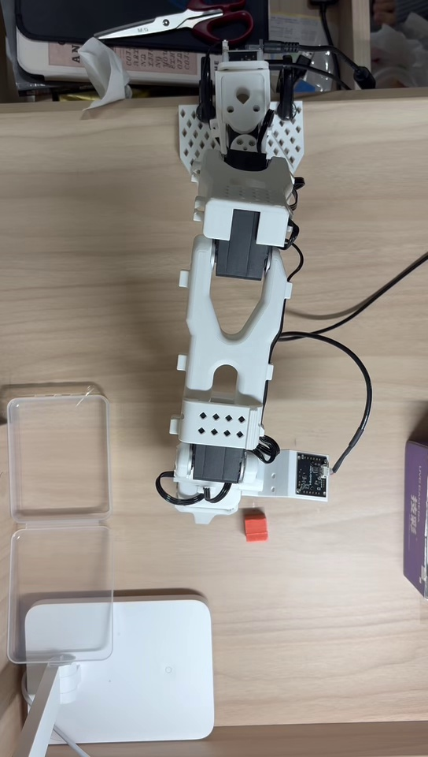
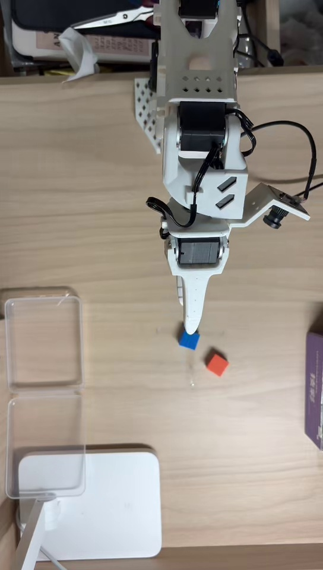

# SO-101 机械臂模仿学习与 VLA 真机部署

> ACT → π0.5 → SmolVLA：围绕示教质量、空间覆盖、部署实时性与真机失败开展的迭代实验

本项目基于 [LeRobot](https://github.com/huggingface/lerobot) 和低成本 SO-101 机械臂，完成从双相机遥操作采集、策略训练到真机推理的闭环。仓库重点保留最终 **SmolVLA 蓝色方块抓放任务**的配置、运行脚本和测试视频，并记录此前 ACT、π0.5 实验对数据设计和系统部署的启发。

任务指令：

```text
Put the blue cube into the right box
```

## 结果摘要

| 阶段 | 数据与改动 | 真机观察 | 结论 |
|---|---|---|---|
| ACT | 首轮 20 条示教；随后重采 30 条连续、高质量示教 | 首轮效果差，重采后成功完成固定位置抓取 | 示教的连续性和一致性比单纯增加训练步数更关键 |
| π0.5 | 51 条示教；云端 GPU 推理 + 本地机械臂执行 | 固定场景可完成任务，但出现延迟、观测帧过期和断联 | 跨网络部署会直接影响闭环动作连续性 |
| SmolVLA（初始） | 红色、蓝色任务各 50 条示教 | 双物体同场时目标选择与抓取不稳定 | 数据中颜色与固定位置的相关性可能形成捷径 |
| SmolVLA（重构后） | 在原 50 条蓝色示教上新增 50 条随机位置示教 | 当前测试范围 **13/13 成功** | 增加空间覆盖后，任务内表现明显改善 |
| SmolVLA（范围外） | 训练空间覆盖之外，约 10 次测试 | 能稳定选择蓝色目标，最终抓取约成功 4–5 次 | 语义泛化好于动作泛化，末端精度仍是瓶颈 |

> `13/13` 仅描述当前测试范围内的一组真机测试，不等同于对所有光照、背景、物体位置和硬件状态的总体成功率估计。范围外测试的 `约 4–5/10` 为实验观察，不作为严格统计指标。

## 核心实验逻辑

### 1. 从 ACT 失败中定位示教质量问题

ACT 首轮使用 20 条示教。方块位置变化较大，同时遥操作轨迹包含较多停顿、犹豫和不连续动作，真机效果较差。随后重新约束采集过程，采集 30 条动作连续、节奏一致的高质量示教，模型成功完成固定位置抓取。这一轮验证了采集规范和示教质量对模仿学习策略的直接影响。

### 2. π0.5 的跨网络部署问题

π0.5 使用 51 条示教，在固定场景下能够完成任务。由于本地算力不足，实验采用“云端 GPU 推理 + 本地机械臂执行”。该架构中观察到网络延迟、观测帧过期和断联，动作连续性受到影响。因此不使用未经严格统计的成功率，也不将问题简单归因于模型本身。

### 3. SmolVLA 的数据覆盖重构

初始数据分别包含红色、蓝色任务各 50 条示教，但物体颜色与位置分布存在较强相关性。在红蓝物体同时出现时，模型的目标选择与抓取不稳定。针对蓝色任务，在原 50 条数据基础上新增 50 条随机位置示教，以削弱颜色—位置捷径并扩大操作空间覆盖。重训后，模型在当前测试范围完成 **13/13 次成功抓取**。

### 4. 将“选对目标”和“完成抓取”分开评估

在训练空间覆盖之外测试时，模型仍能稳定选择正确颜色目标，但约 10 次测试中仅 4–5 次完成最终抓取。这说明模型已表现出较好的目标语义理解，但动作轨迹对新位置的泛化以及末端执行精度仍不足。详细口径与失败假设见 [`docs/EXPERIMENTS.md`](docs/EXPERIMENTS.md)。

## 演示视频

### 当前测试范围

[观看完整视频](media/fixed-placement-test.mp4)



### 训练空间覆盖之外

[观看视频上半段](media/random-placement-test-part1.mp4) · [观看视频下半段](media/random-placement-test-part2.mp4)



## SmolVLA 实验配置

- 机械臂：SO-101 follower
- 相机：腕部相机 + 顶视相机，640×480、30 FPS
- 蓝色任务数据：100 个 episode，共 52,605 帧
- 训练：20,000 steps，batch size 32，AMP
- 微调范围：action expert 与 state projection
- 冻结部分：视觉编码器
- 离线验证集：未划分；checkpoint 以真机表现比较
- 本地推理实测：约 2–3 Hz

模型与数据：

- 模型仓库：[`lab-czy/smolvla_blue_only_20260913`](https://huggingface.co/lab-czy/smolvla_blue_only_20260913)
- 数据标识：`lab-czy/so101_blue_only_100eps_20260913`
- 本仓库不包含模型权重；权重由 Hugging Face 托管

## 快速开始

### 相机映射

模型训练时使用以下字段，部署时必须保持一致：

| 输入字段 | OpenCV 编号 |
|---|---:|
| `observation.images.wrist` | 0 |
| `observation.images.overhead` | 1 |

不要在此 checkpoint 上直接改用 `camera1` / `camera2` 字段。不同电脑上的相机编号可能变化，运行前应先核对设备枚举顺序。

### 本地 RTC 推理

Windows PowerShell：

```powershell
./scripts/run_rtc.ps1 -PolicyPath "lab-czy/smolvla_blue_only_20260913" -Port "COM24"
```

脚本默认设置目标控制频率为 10 FPS、RTC execution horizon 为 3、单步相对关节目标限制为 3°。实际端到端推理频率约为 2–3 Hz；该数值是系统观测结果，不代表瓶颈已经定位，也不应直接归因于 GPU。潜在影响因素包括模型推理耗时、相机/USB 链路、数据传输与闭环控制调度。

首次部署前请检查脚本中的串口、机械臂 ID、校准目录和相机编号。完整训练参数见 [`configs/train_config.json`](configs/train_config.json)，训练命令见 [`scripts/train_smolvla.sh`](scripts/train_smolvla.sh)。配置中的数据与输出路径是本次实验快照，复现时应通过参数或环境变量替换为本机路径。

## 项目结构

```text
.
├── README.md                  # 项目主线、结果与复现入口
├── configs/
│   └── train_config.json      # SmolVLA 训练配置快照
├── docs/
│   └── EXPERIMENTS.md         # 实验迭代、评估口径与失败分析
├── media/                     # 真机测试视频与预览图
└── scripts/
    ├── run_rtc.ps1            # Windows 本地 RTC 推理
    └── train_smolvla.sh       # SmolVLA 训练命令
```

## 当前限制与后续验证

- 当前结果来自有限次数、有限环境条件下的真机测试，尚未形成多随机种子或大样本评估。
- 约 2–3 Hz 的端到端频率瓶颈尚未完成分段计时定位，需要分别测量模型前向、图像采集/传输、动作生成与机器人执行延迟。
- 低成本机械臂的回差、结构刚性和重复定位误差可能影响末端抓取，但仍需通过重复定位与开环/闭环对照实验量化。
- 后续应扩大位置、光照、背景和干扰物覆盖，并分别记录目标选择、到达、闭合夹爪和放置等阶段性成功率。

## 安全提示

- 首次运行时清空机械臂运动范围，并准备随时急停或断电。
- `sync` 或 RTC 不是硬件安全系统。
- `max_relative_target` 只能限制相邻关节目标变化，不能替代机械限位和现场监护。
- 校准文件、相机字段和机械臂 ID 必须与采集/训练设置一致。
